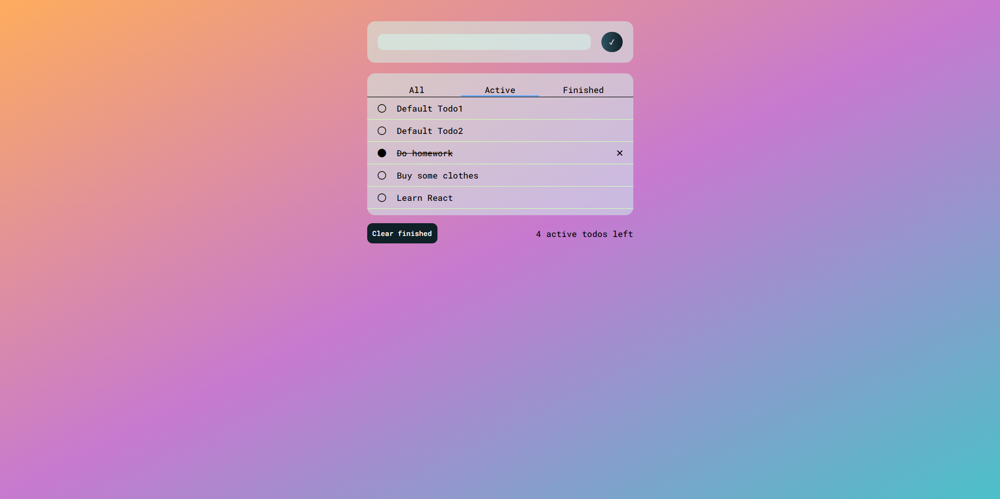

# Todo App

Live website : https://fatihbulbul1.github.io/react-todo-app/
# Overview

Made by:
- **React**
- **React hooks**
- HTML
- CSS
- JS

### Fonts

- Roboto Monospace 500

```css
<style>
@import url('https://fonts.googleapis.com/css2?family=Roboto+Mono:wght@400;500&display=swap');
</style>
```
### Background
``` css
    background: linear-gradient(to top left,
  #4BC0C8,
  #C779D0,
  #FEAC5E);
```
## Description 
- To-do app which written by React. You can add and delete todos. *Currently no local storage
support.*
- "Clear completed" button only available when "Active" page is displaying.
- You can remove todos one-by-one via X icon.
- Shows how many active todo left.

### Author
- LinkedIn - [Ömer Fatih Bülbül](https://www.linkedin.com/in/ömer-fatih-bülbül-74a890236/)
- Twitter - [fatihbulbul91](https://twitter.com/fatihbulbul91)
